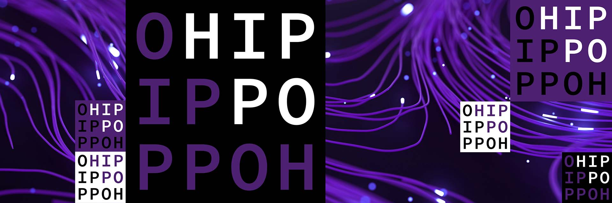

# JUSTICE Integrated Assessment Framework


[](https://doi.org/10.5281/zenodo.15145122)
<p align="center">
  
</p>

JUSTICE (JUST Integrated Climate Economy) is an open-source Integrated Assessment Modelling Framework allowing exploration of modelling assumptions on Climate Policies. JUSTICE is a simulation-optimization model that enables multiobjective optimization using Multiobjective Evolutionary Algorithm (MOEA) and Multiagent Multiobjective Reinforcement Learning (MOMARL).

JUSTICE is designed to explore the influence on distributive justice outcomes due to underlying modelling assumptions across model components and functions: the economy and climate components, emissions, abatement, damage and social welfare functions. JUSTICE is a simple IAM inspired by the long-established RICE, and RICE50+, and is designed to be a surrogate for more complex IAMs for eliciting normative insights.

### JUSTICE Overview


### Documentation

The documentation for JUSTICE can be found [here](https://pollockdevis.github.io/JUSTICE/). [PENDING]

JUSTICE is developed by the [HIPPO Lab](https://www.tudelft.nl/ai/hippo-lab) at the Technology, Policy, and Management Faculty of [Delft University of Technology](https://www.tudelft.nl/en/tpm/).

<p align="center">
  
  
</p>


### Installation
Create and activate a virtual environment and install as a package using

```
pip install .
```

### Running JUSTICE MOMARL

#### Training

JUSTICE-MOMARL can train multi-agent and multi-objective policies and currently support optimising for two objectives. JUSTICE-MOMARL converts the multi-objective training into a single objective by generating various policies with different weight combinations that weight each objective. The entire training process generates **100 different weight combinations** and trains each policy by linearising and normalising the reward and using **Multi Agent Proximal Policy Optimization (MAPPO)** as the reinforcement learning algorithm.

Instead of training all the 100 weights together, we divide the training into batches and train a subset of weight combinations in each batch. For example, in order to train the first 10 uniform weight combnations, balancing the global economic output and inverse global temperature reward functions, run the following:

```bash
python train.py --start_uniform_weight 0 --end_uniform_weight 10 --env-config.rewards "global_economic_output" "inverse_global_temperature" --seed=<Seed> --base_save_path="Path where results are saved"
```

You can view the additional argument to modify the JUSTICE modules and the RL hyperparameters by looking at the `Args` and `EnvConfig` dataclasses in `rl/args.py`.

This script will save the checkpoints, pickled configs and multi-objective vectorised returns for trained policies for each weight combination in the base_save_path provided.

#### Evaluation
Once models have been trained for different weight combinations and the checkpoints for each of them are saved, you can run the evaluation for one specific weight combination and for one evaluation seed by running:

```bash
python eval.py --checkpoint_path="Absolute path to the checkpoint for policy" --seed=0 --output_path="Directory where evaluation results are saved""
```
The evaluation script will run the MOMARL policy in the JUSTICE simulation and save the evolution of various economic and climate metrics over time where the Emission Control Rate and Savings Rates are set by the trained policy in each time step.