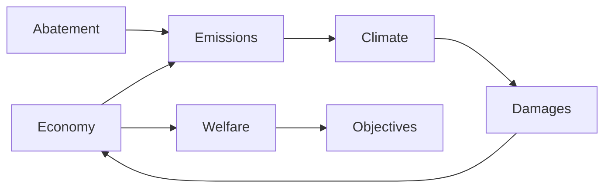

# Model overview

## Structure

```mermaid
flowchart LR
    economy[Economy] --> emissions[Emissions]
    abatement[Abatement] --> emissions
    emissions --> climate[Climate]
    climate --> damages[Damages]
    damages --> economy
    economy --> welfare[Welfare]
    welfare --> objectives[Objectives]
```

## Time horizon

## Regions

## Scenarios

## Uncertainty
