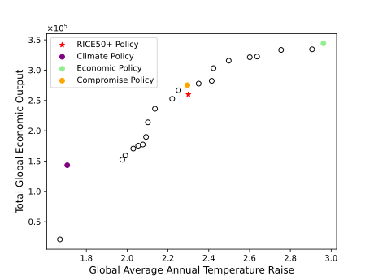

# File Structure for Paper Results  

- **`eval_results/`** → Stores all evaluation results (plots, metrics, etc.)  
- **`paper_policies/`** → Contains the checkpoints for the 3 selected policies:  
  - **Climate** → Best policy for minimizing climate impact  
  - **Economic** → Best policy for maximizing economic output  
  - **Compromise** → Balances both climate and economic objectives  
- **`training_results/`** → Stores training checkpoints and training plots  
  - **`seed-1/`** → Checkpoints and metrics for training run with Seed 1
  - **`seed-2/`** → Checkpoints and metrics for training run with Seed 2
  - ...
  - **`seed-10/`** → Checkpoints and metrics for training run with Seed 10
- **`plot_training_metrics.py`** → Script to visualize training performance metrics using the policies trained above. This plots the following:
  - **Hypervolume Progression** → Measures diversity and quality of Pareto front over training.  
  - **Cardinality & Sparsity** → Analyzes Pareto front density and spread.  
  - **Expected Utility** → Tracks policy performance across training steps.  
  - **Training Performance per Seed** → Aggregated and individual training plots for each seed.  
- **`paper_eval.py`** → Script to generate evaluation plots. It generates the following plots for each of the 3 selected policies:
  - **Time-series plots**: Economic output, emissions, temperature, and abated emissions over time.  
  - **Regional maps**: Abated emissions per region.  
  - **Gini coefficient plots**: Measures inequality over time.  
- **`paper_eval.ipynb`** → Jupyter notebook for interactive evaluation  which plots the same plots as above
- **`constants.py`** → Contains predefined constants used in evaluation.

# Reproducing Results
## Reproducing Training Metrics
You can train policies for 100 weight combinations for 10 seeds using the `train.py` script as described [here](/README.md). We provide the all the trained policies in the `training_results` folder. You can reproduce the training metrics by running `python paper/plot_training_metrics.py` from the root directory. This script the folder structure for training_results described above.

## Reproducing Evaluation Metrics
We run evaluation on the 3 chosen policies, climate, economic and compromise. These policies can be seen in the Pareto Front below:

Here are the specific policies representing each of the chosen policies:
- **Climate** → Seed: 10, Weight Combination: [0.4506 0.5494]
- **Economic** → Seed: 10, Weight Combination: [0.7562 0.2438]
- **Compromise** → Seed: 5, Weight Combination: [0.1021 0.8979]

In order to reproduce the evaluation results, you can run `python paper/paper_eval.py` or run the `paper_eval.ipynb` notebook.